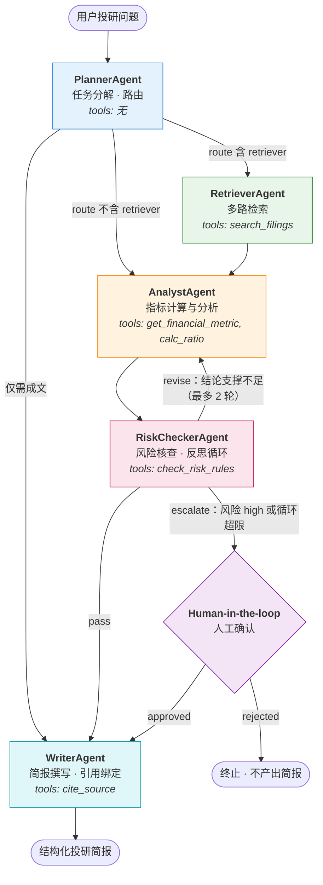
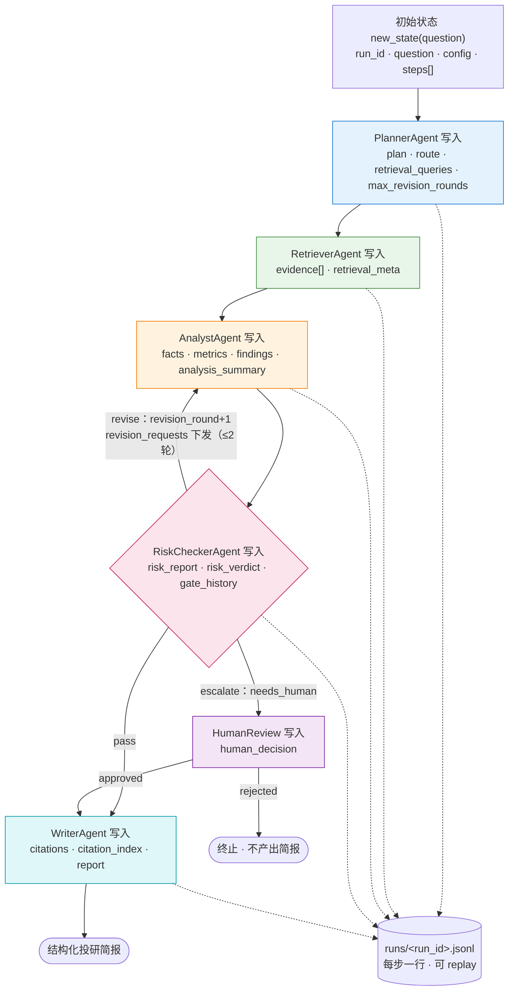

# FinResearch-MAS · 金融投研多智能体系统

> 一个**真正能跑起来**的金融投研多智能体（Multi-Agent）开源项目：5 个职责隔离的 Agent
> 在 LangGraph 图上协作，带**反思循环**（RiskChecker 打回 Analyst 重算）、
> **人机协同**（高风险结论暂停等人工确认）、**全链路可观测**（每步一行 JSONL + 回放）
> 与**可量化评估**（4 项指标）。没有 API Key 也能完整跑通 —— 无 Key 时自动进入确定性 mock 模式。

<p align="left">
  
  
  
  
  
</p>

---

## 一、这是什么

给定一个自然语言投研问题（例如「示例科技股份有限公司 2024 年度盈利能力与现金流质量如何？
有哪些主要风险？」），系统会：

1. **拆解**问题、决定路由（PlannerAgent）
2. **多路检索**本地投研资料库，返回带出处的证据（RetrieverAgent）
3. **调用工具**计算财务比率并形成有论证链的结论（AnalystAgent）
4. **独立核查**结论是否被数据支撑，发现异常指标未做交叉验证就打回重算（RiskCheckerAgent）
5. **人工确认**高风险结论（Human-in-the-loop）
6. **生成**每条结论都带引用编号的结构化投研简报（WriterAgent）

产出的简报里每一个 `[1]` 都能一路回溯到：引用记录 → 证据子块 ID → 父块章节 → 资料文件路径。

### 核心特性

| 能力 | 实现 |
| --- | --- |
| 编排层 | **LangGraph** `StateGraph` + 条件边 + `MemorySaver` checkpointer；另内置接口兼容的自研图引擎作降级 |
| 多智能体 | 5 个 Agent，各自独立 system prompt、工具白名单、权限集合、trace |
| 反思循环 | RiskChecker → Analyst 最多重算 2 轮，超限升级为「需人工确认」 |
| 人机协同 | 高风险 / 循环超限时暂停等人工批准；`--auto` 或非交互环境自动放行 |
| 工具层 | MCP 风格注册中心：JSON Schema 强校验 + 权限分级 + 超时 + 重试 + 幂等缓存 |
| RAG | 父子块切分 + 手写 BM25 + 确定性哈希向量 + 可配置加权重排 |
| LLM | OpenAI 兼容接口；**无 Key 自动降级为确定性 mock 大脑**，全流程离线可跑 |
| 可观测 | 每步一行 JSONL（step/agent/input_digest/output_digest/latency_ms/status）+ `python -m src.replay` 回放 |
| 评估 | 5 条样例：任务完成率 / 检索命中率 / 引用可追溯率 / 平均耗时 |
| 测试 | 80 个 pytest 用例，全绿，全程离线 |

> ⚠️ **数据声明**：`data/` 下的公司与全部数据、事件均为**虚构**（「示例科技股份有限公司」
> 「示例智造银行股份有限公司」），与任何真实主体无关。本项目仅用于技术演示，不构成投资建议。

---

## 二、架构

### 2.1 Agent 拓扑与条件边



三条**条件边**是多智能体与「一条链」的本质区别：

| 条件边 | 路由函数 | 分支 |
| --- | --- | --- |
| `planner → ?` | 读 `state["route"]` | `retriever` / `analyst` / `writer` |
| `risk_checker → ?` | 读 `state["risk_verdict"]` | `analyst`（打回）/ `human_review`（升级）/ `writer`（通过） |
| `human_review → ?` | 读 `state["human_decision"]` | `writer`（批准）/ `END`（驳回） |

### 2.2 共享状态（Blackboard）的填充与流转



状态是**所有 Agent 唯一的通信媒介**（没有 Agent 之间直接函数调用），因此：
任何时刻的状态快照 = 系统当前知道的一切；状态 + 路由函数 = 完全可复现的执行路径。
字段分组与用途见 [5.3](#53-共享状态里有什么为什么是这些)。

### 2.3 一次真实运行的执行路径

```
planner -> retriever -> analyst -> risk_checker -> analyst -> risk_checker -> human_review -> writer
                          ↑______________________|  (revise：异常指标未做交叉验证)
```

---

## 三、快速开始

### 3.1 安装

```bash
git clone <this-repo>
cd 个人项目_金融投研多智能体

python -m pip install -r requirements.txt
```

可选：接入真实 LLM（不配置也能跑，会自动进入 mock 模式）

```bash
cp .env.example .env
# 然后设置环境变量
export OPENAI_API_KEY=sk-xxxx
export OPENAI_BASE_URL=https://api.openai.com/v1   # 任何 OpenAI 兼容服务均可
export MODEL_NAME=gpt-4o-mini
```

### 3.2 跑一次投研（mock 模式，零依赖外部服务）

```bash
python -m src.demo --auto
```

Windows PowerShell 建议显式指定 UTF-8，避免中文乱码：

```powershell
$env:PYTHONIOENCODING="utf-8"; python -m src.demo --auto
```

常用参数：

```bash
python -m src.demo --question "示例智造银行股份有限公司 2024 年资产质量如何？" --auto
python -m src.demo --engine native      # 强制使用自研降级图引擎
python -m src.demo --run-id my-run-001  # 指定运行编号，便于回放
```

### 3.3 回放执行过程

```bash
python -m src.replay <run_id>
```

逐行还原每一步：执行者、耗时、输入/输出摘要与预览、工具调用（权限 / 是否命中缓存 / 重试次数）、
以及每步的业务留痕（规划结果、证据、比率、裁决、引用）。

### 3.4 跑评测

```bash
python eval/run_eval.py
```

输出任务完成率 / 检索命中率 / 引用可追溯率 / 平均耗时，并把明细写入 `eval/last_report.json`。
三项核心指标不达标时脚本以退出码 1 结束，可直接接入 CI。

### 3.5 跑测试

```bash
pytest -q
```

---

## 四、目录结构

```
个人项目_金融投研多智能体/
├── README.md
├── requirements.txt
├── pytest.ini                    # pytest 配置（pythonpath=. / testpaths=tests）
├── conftest.py                   # 根 conftest，保证 src 可导入
├── .env.example                  # LLM / 循环轮次 / 引擎 等环境变量样例
│
├── data/                         # ★ 全部为虚构数据
│   ├── 示例科技_2024_年度报告摘要.md
│   ├── 示例科技_2024_三季度报告.md
│   └── 示例智造银行_2024_年度报告摘要.md
│
├── src/
│   ├── config.py                 # 全局配置（路径 / 检索权重 / 循环上限 / LLM）
│   ├── state.py                  # ★ Blackboard 共享状态定义
│   ├── orchestrator.py           # ★ 图装配：节点、条件边、反思循环、运行入口
│   ├── engine_langgraph.py       # LangGraph 主引擎适配层
│   ├── engine_native.py          # 自研接口兼容图引擎（Node/Edge/ConditionalEdge/Checkpointer）
│   ├── tracing.py                # 每步一行 JSONL 的可观测记录
│   ├── hitl.py                   # 人机协同（暂停 / 批准 / 驳回）
│   ├── demo.py                   # CLI 演示：python -m src.demo
│   ├── replay.py                 # 轨迹回放：python -m src.replay <run_id>
│   │
│   ├── agents/                   # ★ 五个 Agent
│   │   ├── base.py               #   基类：工具白名单 + 权限 + 统一 trace 模板方法
│   │   ├── planner.py            #   任务分解与路由
│   │   ├── retriever.py          #   多路检索与证据筛选
│   │   ├── analyst.py            #   指标计算与分析（数字全部来自工具）
│   │   ├── risk_checker.py       #   核查门 + 风险规则 + 反思循环驱动
│   │   └── writer.py             #   简报撰写与引用绑定
│   │
│   ├── tools/                    # ★ MCP 风格工具层
│   │   ├── registry.py           #   注册中心：schema/权限/超时/重试/幂等缓存
│   │   ├── schema_validator.py   #   轻量 JSON Schema 校验器（零依赖）
│   │   └── builtin.py            #   5 个内置工具 + 20 条风险规则
│   │
│   ├── rag/
│   │   ├── corpus.py             #   文档加载（front-matter + Markdown 表格）
│   │   ├── chunking.py           #   父子块切分
│   │   ├── embedding.py          #   确定性哈希向量（手写，无外部 API）
│   │   ├── bm25.py               #   手写 Okapi BM25
│   │   ├── facts.py              #   结构化财务事实抽取 + 指标别名归一化
│   │   └── retriever.py          #   BM25 + 向量 + 元数据 混合检索与重排
│   │
│   ├── llm/
│   │   ├── client.py             #   OpenAI 兼容客户端 + 自动降级
│   │   ├── prompts.py            #   每个 Agent 独立的 system prompt
│   │   └── mock.py               #   确定性规则大脑（离线模式）
│   │
│   └── utils/                    # 文本分词 / digest / 控制台编码 / 可序列化净化
│
├── eval/
│   ├── cases.json                # 5 条评测样例
│   ├── run_eval.py               # 评测脚本
│   └── last_report.json          # 最近一次评测明细（运行后生成）
│
├── runs/                         # 执行轨迹（运行后生成，每步一行 JSONL）
└── tests/                        # 80 个用例
    ├── conftest.py
    ├── test_tools_schema.py          # 工具 schema / 权限 / 超时 / 重试 / 幂等
    ├── test_state_flow.py            # 状态流转 / 条件边 / 图引擎 / 死循环保护
    ├── test_risk_loop.py             # 反思循环 / 打回 / 超限升级人工
    ├── test_citation_traceability.py # 引用可追溯 / 最小权限
    ├── test_mock_llm.py              # mock 模式 / 降级 / trace 字段 / 回放
    └── test_rag.py                   # 父子块 / 向量 / BM25 / 重排 / 事实抽取
```

---

## 五、Agent 设计要点

> 这一节是整个项目的设计说明，也是面试时最值得展开的部分。

### 5.1 为什么拆成 5 个 Agent，而不是一个 Prompt 干完？

单个大 Prompt 做投研有四个绕不过去的问题：**上下文被检索原文淹没**、**数字容易被模型编**、
**没人复核结论**、**出错无法定位**。拆成 5 个 Agent 是沿着「认知步骤 + 职责冲突」两条线切的：

| Agent | 一句话职责 | 为什么必须独立 |
| --- | --- | --- |
| Planner | 拆任务 + 决定路由 | 规划者一旦能看到原文就会提前下结论，所以它**不持有任何工具**，只看到元信息 |
| Retriever | 找证据 | 只负责召回，不做判断，避免「先有结论再找证据」的确认偏误 |
| Analyst | 算指标 + 出结论 | 数字必须来自工具，见 5.2 |
| RiskChecker | 核查 + 打回 | **与 Analyst 利益冲突**：出结论的人不会主动否定自己，必须由独立角色复核 |
| Writer | 成文 + 绑引用 | 引用编号是全局资源，必须单一职责分配，否则多 Agent 各编各的必然错乱 |

拆分的收益不只是"看起来专业"，而是可测量：每个 Agent 有自己的 trace 行、自己的工具调用记录、
自己的权限集合，出错时能精确定位到「是检索没召回，还是分析师算错了，还是核查没拦住」。

### 5.2 职责边界怎么划：数字归工具，语言归模型

这是本项目最重要的一条工程约束：

```
❌ 让 LLM 从年报原文里"读"出净利润 → 幻觉、不可审计、口径漂移
✅ 结构化事实库 + 比率计算器产出数字 → LLM 只负责解释数字之间的关系
```

* `data/*.md` 中的 Markdown 指标表被解析成 `(公司, 指标, 年份, 期间) -> 数值` 的结构化事实库，
  由 `get_financial_metric` 提供，每条事实都带 `source_id` 与所在章节。
* 所有比率由 `calc_ratio` 计算，返回公式、输入值、单位与基准提示，**不接受模型口算**。
* AnalystAgent 的**领域策略是确定性的**（哪个维度算哪几个比率），**语言是模型的**。
* 结论里出现的 `ratio_refs` / `evidence_ids` 会被二次校验，不在真实清单内的引用一律剔除并记入
  `state["errors"]` —— 这就是针对模型幻觉的**结构性防御**，而不是靠提示词"求它别编"。

同理，RiskChecker 的**裁决是确定性函数**（`_decide`），不交给模型：
合规闸门不能因为模型这次心情好就放行。模型只负责写核查叙述；若模型裁决与闸门不一致，
会在 `risk_report.verdict_override` 中留痕，并按**闸门**执行。

### 5.3 共享状态里有什么，为什么是这些

`ResearchState` 按「归属」分块（见 2.2），核心字段：

| 字段 | 类型 | 作用 |
| --- | --- | --- |
| `plan` / `route` | dict / list | Planner 的产出，`route` 直接驱动条件边 |
| `evidence` | list | 检索证据，每条形如 `{child_id, source_id, section_title, text, context, score, components}` |
| `facts` | dict | 工具取回的原始指标（含出处），键为 `指标\|年份\|期间` |
| `metrics` | dict | 计算得到的比率（含公式、显示值、supplementary 标记） |
| `findings` | list | 分析结论，带 `ratio_refs` / `evidence_ids` / `cross_checks` |
| `risk_report` | dict | 风险规则命中明细 + **`gate_history`（每轮核查留痕）** |
| `risk_verdict` | str | `pass` / `revise` / `escalate`，条件边的输入 |
| `revision_round` / `revision_requests` | int / list | 反思循环的计数与整改要求 |
| `citations` / `citation_index` | list / dict | 引用编号 ↔ 资料编号的映射，可追溯性的基础 |
| `steps` / `errors` / `llm_stats` | — | 观测字段 |

两个容易被忽略但很关键的细节：

* **`gate_history` 必须留痕**。循环收敛后当前缺口会归零，如果只保留"当前缺口"，
  "当初为什么被打回"就永久丢失，事后无法复盘。这是我们踩过的坑。
* **状态里不放大段原文**。`evidence` 只保留命中的子块与必要的父块上下文，
  避免状态膨胀导致 checkpointer 序列化开销失控。

### 5.4 反思循环怎么防死循环

四道保险，任何一道都够用，但都加上：

1. **轮次计数**：`revision_round` 由状态持有，每次 `revise` 递增；`revision_round >= max_revision_rounds`
   时裁决函数**强制**改为 `escalate`，不再打回。
2. **拓扑约束**：回边只允许 `risk_checker → analyst`，**不可能绕回 planner**，
   所以不存在「重新规划 → 重新检索 → 重新分析」的放大环路。
3. **引擎兜底**：`recursion_limit=40`，超限抛 `GraphExecutionError` 而不是把进程挂死（有专门单测覆盖）。
4. **收敛可验证**：循环判据是"缺口是否被消除"，而缺口是**可执行、可检查**的
   （补证据 / 补量化支撑 / 补交叉验证），不是"再想想"。测试 `test_revision_requests_are_actionable`
   断言第 1 轮有缺口、第 2 轮缺口清零 —— 循环必须真的收敛，而不是原地打转。

**超限之后不是继续重算，而是降级为「需人工确认」**：把不确定性交给人，而不是让模型无休止地自我说服。
这是本项目在「自动化」和「可控性」之间的明确取舍。

### 5.5 工具层为什么要权限分级与幂等

**权限分级**（`public_read` / `restricted_read` / `compute` / `write`）：

* 越权不是靠提示词约束的，而是**代码强制**：`BaseAgent.call_tool` 先查工具白名单，
  再在注册中心校验权限等级，不通过直接返回 `TOOL_NOT_ALLOWED` / `PERMISSION_DENIED`，根本不执行。
* 权限按最小化分配：Planner 没有任何工具；Retriever / Analyst 只有只读与计算；
  **只有 Writer 持有 `write`**（分配全局引用编号）。单测
  `test_only_writer_agent_holds_write_permission` 直接验证这条不变量。
* 现实映射：投研系统里"读财报"和"下单/对外发报告"的风险等级天差地别，权限必须能在代码里表达。

**幂等与缓存**：

* 每个工具声明 `idempotent`。幂等工具用 `sha256(工具名 + 规范化 JSON 参数)` 做缓存键，
  参数顺序无关；非幂等工具（`cite_source`，每次分配新引用序号）绝不缓存。
* 好处直接可见：Analyst 在重算循环里会重复取同一指标，命中缓存后
  `ToolCallRecord.cached=True`，重算轮几乎没有额外成本。
* 反过来，如果 `cite_source` 被误当成幂等，同一资料会拿到两个编号，引用表直接崩 ——
  这个标记不是装饰，是正确性的一部分。

**统一异常 / 超时 / 重试**：所有工具调用都收敛成 `ToolResult(ok, data|error)`，**永不向 Agent 抛异常**。
超时用线程池 `future.result(timeout)`；重试只针对**瞬时故障**（`TimeoutError` / `ConnectionError` / `OSError`），
业务异常（如分母为 0）重试没有意义，直接失败。工具层还统一做 `to_plain` 净化，
杜绝 numpy 标量泄漏进状态（这个坑真实存在：`np.float64` 不是 msgpack 可序列化类型，
会让 LangGraph 的 checkpointer 崩在半路）。

### 5.6 怎么做可观测与评估

**可观测**：`runs/<run_id>.jsonl` 每步一行，固定字段
`step / agent / input_digest / output_digest / latency_ms / status`，另附
`input_preview / output_preview / tool_calls`。每行写完立即 flush，进程被强杀也不丢轨迹。
`python -m src.replay <run_id>` 把轨迹还原成人能读的时间线。

trace 用 **digest 而不是全量内容**：既避免日志爆炸，也保留"这次运行和上次是不是走了同一条路"的比对能力。

**评估**：`eval/run_eval.py` 在 5 条样例上给出四个指标，每个指标都有明确定义：

| 指标 | 定义 | 为什么用它 |
| --- | --- | --- |
| 任务完成率 | 报告非空 + 含全部期望章节 + 含期望关键词 + 结论数达标 | 端到端"有没有交付" |
| 检索命中率 | 期望资料编号在本次证据中的覆盖率 | 召回质量，与生成解耦 |
| 引用可追溯率 | 报告中每个 `[n]` 都能在引用清单里回溯 | **投研场景的底线**：不可追溯的结论等于编造 |
| 平均耗时 | 端到端平均墙钟耗时 | 工程可用性 |

指标不达标时脚本以退出码 1 结束，可直接卡 CI。

---

## 六、工具层：5 个 MCP 风格工具

| 工具 | 权限 | 超时 | 幂等 | 入参（JSON Schema 摘要） | 说明 |
| --- | --- | --- | --- | --- | --- |
| `search_filings` | `public_read` | 5s | ✔ | `query*, top_k, company?, year?, doc_type?, strict` | 混合检索，返回带出处片段与父块上下文 |
| `get_financial_metric` | `public_read` | 3s | ✔ | `company*, metric*, year?, period?` | 结构化指标，支持别名归一（「营收」→「营业收入」） |
| `calc_ratio` | `compute` | 2s | ✔ | `ratio_name*, numerator*, denominator*, precision?, label?` | 15 种比率 / 增长率，返回公式与基准 |
| `check_risk_rules` | `restricted_read` | 4s | ✔ | `company*, year*, extra_facts?, min_level?, period?` | 20 条风险规则，按主体类型（工商企业/金融机构）启用规则集 |
| `cite_source` | `write` | 3s | ✘ | `source_id*, section_keyword?` | 解析引用并分配全局引用编号 |

JSON Schema 不只是文档，它同时是：**调用前的强校验**（挡住幻觉参数）+ **喂给 LLM 的 function-calling 声明**
（`registry.describe()` 导出）。校验器为手写零依赖实现，报错信息精确到
「哪个字段 / 期望什么 / 实际得到什么」，方便 Agent 自我纠错。

规则引擎的一个真实领域细节：**银行不能套用工商企业的杠杆规则**。
银行的资产负债率天然在 90% 以上（存款是负债），若直接套用「> 70% 即高风险」，
会对所有银行产生系统性误报。因此规则带 `entities` 标记，
检测到「不良贷款率 / 拨备覆盖率」等指标即判定为金融机构，切换规则集。

---

## 七、RAG 设计

**父子块切分**：Markdown 章节 = 父块（语义完整、便于标注出处章节）；章节内部再切成
~160 字符、40 字符重叠的子块入索引。命中子块后回填父块上下文 —— 兼顾检索精度与生成上下文完整性。

**检索**：

```
查询 ─┬─ BM25（手写 Okapi，稀疏/词面）        ─┐
      ├─ 哈希向量（blake2b hashing trick，稠密） ├─ min-max 归一化 ─ 加权融合 ─ Top-K ─ 父块回填
      └─ 元数据匹配（公司/年份/文档类型）        ─┘

final = w_kw·keyword + w_vec·vector + w_meta·metadata     # 权重在 src/config.py 可配置
keyword = 0.7·BM25_norm + 0.3·命中词占比
```

* **向量是确定性的哈希向量**：`token → blake2b → 桶下标 + 符号位`，子线性词频加权后 L2 归一化。
  刻意不用 Python 内置 `hash()`（带 `PYTHONHASHSEED` 随机化），保证跨机器跨进程完全一致。
  要接真实 embedding，只需替换 `src/rag/embedding.py` 的 `embed()` / `embed_matrix()`。
* **中文分词零依赖**：中文单字 + 相邻二元组 + 英文数字整词，兼顾召回与短语区分度。
* **额外一路信号「命中词占比」**：BM25 对长文档有天然偏置，
  而"查询里的关键财务词有多少真的出现在这块里"对金融问答是强信号。

---

## 八、编排层：LangGraph 与降级方案

**主引擎：LangGraph（实测 `langgraph==1.2.12` 安装并使用成功）**

```python
graph = StateGraph(ResearchState)          # TypedDict 作为共享状态 schema
graph.add_node("planner", planner.run)
graph.add_conditional_edges("risk_checker", route_after_risk, {...})
compiled = graph.compile(checkpointer=MemorySaver())
```

**降级方案：`src/engine_native.py`（自研接口兼容图引擎）**

考虑到不同机器/CI 环境下第三方依赖未必装得上，项目内置了一个零依赖的图引擎，
实现了本项目用到的全部能力：`Node / Edge / ConditionalEdge / State / Checkpointer`、
条件边、共享状态、入口点、`invoke` / `stream`、内存检查点、递归步数上限。

接口刻意与 LangGraph 对齐（`add_node` / `add_edge` / `add_conditional_edges` /
`set_entry_point` / `compile` / `invoke`），因此 `orchestrator.py` 换引擎时**业务代码零改动**；
`auto` 模式下 LangGraph 不可用会**自动静默降级**，也可以用 `--engine native` 显式指定。

单测 `test_both_engines_produce_the_same_execution_path` 对两个引擎跑了同一条拓扑做对照验证。

**与 LangGraph 的差异（如实说明）**：自研引擎不支持并行分支与 fan-in、
状态通道只有「整体覆盖」语义（不支持 `Annotated` reducer）、checkpointer 只在内存中，
不支持时间旅行恢复到任意历史快照。本项目拓扑是「线性 + 一条反思回边」，用不到这些能力。

---

## 九、Mock 模式说明（无 API Key 时的行为）

没有配置 `OPENAI_API_KEY`（或设置 `MOCK_LLM=1`）时，系统自动切换到
`src/llm/mock.py` 的**确定性规则大脑**。它返回的 JSON 结构与真实 LLM **完全一致**，
因此上层 Agent 代码零改动，`python -m src.demo` 与 `pytest` 永远能跑通。

它不是"随便返回一段假文本"，而是一个**可复现的规则策略**：

* 用关键词 + 正则解析问题（公司、年份、期间、分析维度）；
* 用阈值表对比率做定性判断（优于/低于基准、是否恶化）；
* 严格按 RiskChecker 的打回意见补充交叉验证说明。

真机模式下同一份 prompt 会发给真实模型；两者行为可用 `eval/run_eval.py` 对齐比较。
另外，**真机调用失败会自动降级回 mock**（`LLMResponse.degraded=True` 留痕），
保证演示与评测不因外部服务抖动而中断。

---

## 十、测试

```bash
pytest -q
```

80 个用例，覆盖：

| 文件 | 覆盖点 |
| --- | --- |
| `test_tools_schema.py` | 工具属性完整性、schema 缺参/类型/区间/枚举/多余参数、权限分级、统一异常、超时、瞬时故障重试、业务异常不重试、幂等缓存（含非幂等反例）、工具正确性 |
| `test_state_flow.py` | 状态契约、端到端流转顺序、route 驱动条件边、trace 行数一致、自研引擎条件边/checkpointer/死循环保护、无出边节点拒绝编译、双引擎路径一致性 |
| `test_risk_loop.py` | 反思循环真实发生（analyst 访问 2 次）、打回意见可执行、Analyst 响应打回补交叉验证、核查门四种缺口、**超限必须升级人工**、裁决纯函数、低风险不打扰人工 |
| `test_citation_traceability.py` | 报告引用全部可回溯、每条结论都带引用、结论有证据支撑、引用指向真实文件、`cite_source` 边界、最小权限不变量 |
| `test_mock_llm.py` | 无 Key 自动 mock、有 Key 走真机、真机失败降级、输出确定性、规划/检索/核查策略、全流程离线跑通、trace 固定字段、回放可读 |
| `test_rag.py` | 父子块一致性、向量确定性与归一化、相似度语义、BM25 排序、重排权重可配置、元数据过滤、多路合并去重、事实抽取/别名/期间区分、**虚构数据合规性检查** |

测试全程 `MOCK_LLM=1` 且不依赖网络，结果可复现。

---

## 十一、技术栈

| 层次 | 选型 | 说明 |
| --- | --- | --- |
| 语言 | Python 3.10+（实测 3.12.14） | 全量中文注释 |
| 编排 | **LangGraph 1.2.12** + langchain-core 1.6.6 | `StateGraph` / 条件边 / `MemorySaver` |
| 降级编排 | 自研 `engine_native.py` | 零依赖、接口兼容的图引擎 |
| LLM | OpenAI 兼容接口（`openai>=1.30`） | 官方 / vLLM / Ollama / 各类网关均可 |
| 离线大脑 | 自研确定性规则策略 | 无 Key 也能全流程跑通 |
| 数据校验 | 手写 JSON Schema 校验器 + pydantic | 工具入参强校验 |
| 检索 | 手写 BM25 + 确定性哈希向量 | numpy 做向量运算，无外部 embedding 服务 |
| 存储 | 本地 Markdown 资料库 + JSONL 轨迹 | 零运维，便于评审与复现 |
| 测试 | pytest 9.1.1 | 80 用例全绿 |
| 依赖总数 | 6 个直接依赖 | `langgraph` `langchain-core` `pydantic` `openai` `numpy` `pytest` |

---

## 十二、已知限制与后续规划

**限制（如实说明）**

1. 资料库仅 3 篇虚构文档、92 条结构化事实，规模不足以验证大规模检索性能。
2. 哈希向量只捕捉词面重合，不具备真正的语义泛化能力（如"回款变慢" ↔ "现金流恶化"）。
   生产环境应替换为真实 embedding + 向量库。
3. 父子块切分基于 Markdown 结构，面对 PDF / 扫描件需要额外的版面解析环节。
4. 自研降级引擎不支持并行分支、状态 reducer 与历史时间旅行。
5. 风险规则是硬编码阈值表（20 条），未做行业分层与动态阈值。
6. 真实 LLM 路径（非 mock）仅做了接口与降级逻辑的验证，未在本环境实跑过付费 API。

**规划**

- 接入真实 embedding（bge / text-embedding-3）与向量库（FAISS / Milvus），做 A/B 对比
- 用 LLM-as-judge 补充"结论忠实度"指标，与现有 4 项指标组成完整评估矩阵
- 把风险规则配置化（YAML），支持按行业/主体类型挂载规则包
- 增加 FastAPI 服务层与最小 Web UI，支持多轮追问
- 引入 LangSmith / OpenTelemetry 对接，替换本地 JSONL trace

---

## 十三、免责声明

本项目为**技术演示作品**。`data/` 目录下的公司名称、财务数据、经营事件**全部为虚构**，
与任何真实存在的公司、银行、券商或其他主体无关。系统输出的任何内容均不构成投资建议，
请勿据此做出投资决策。

## 十四、License

MIT
