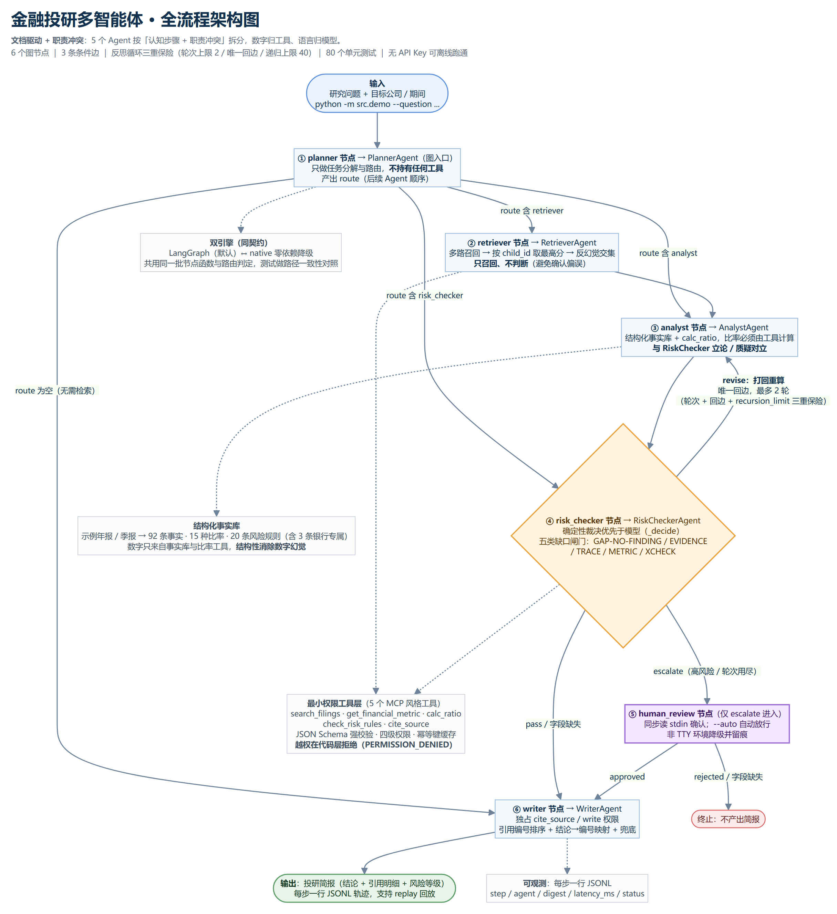
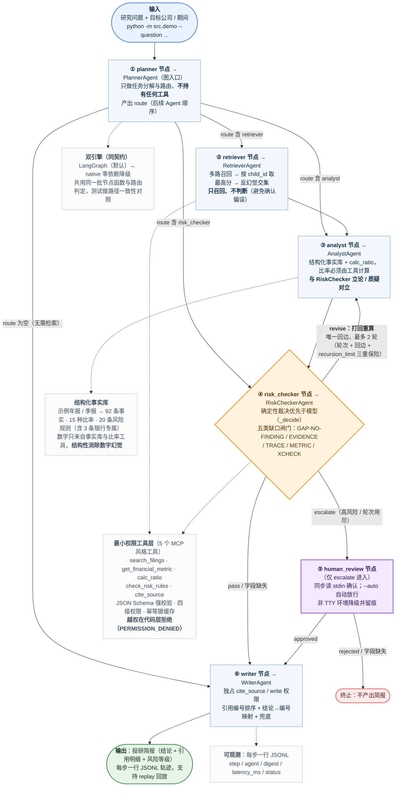

# 金融投研多智能体 · 全流程架构图

> 本文件由项目代码反向核对后整理：节点名、连边、路由分支、常量阈值均取自
> `src/orchestrator.py`（`GraphSpec`：6 节点 / 3 普通边 / 3 条件边）、
> `src/engine_langgraph.py`、`src/engine_native.py`、`src/config.py`，与代码一致。

## 一句话定位

**文档驱动 + 职责冲突**：5 个 Agent 按「认知步骤 + 职责冲突」拆分，数字归工具、语言归模型；结论必须可追溯，模型幻觉等于编造。

## 图结构（与代码一一对应）

| 项 | 值 |
| --- | --- |
| 节点 | 6 个：`planner` / `retriever` / `analyst` / `risk_checker` / `human_review` / `writer` |
| 入口 | `planner` |
| 普通边 | `retriever→analyst`、`analyst→risk_checker`、`writer→END` |
| 条件边 | `planner`（→retriever / analyst / risk_checker / writer）、`risk_checker`（→analyst / human_review / writer）、`human_review`（→writer / END） |
| 反思循环 | `risk_checker→analyst` 是**唯一回边**；轮次上限 `MAX_REVISION_ROUNDS=2`；`GRAPH_RECURSION_LIMIT=40`（三重保险） |
| 工具层 | 5 个 MCP 风格工具（search_filings / get_financial_metric / calc_ratio / check_risk_rules / cite_source），四级权限 + JSON Schema + 幂等键缓存 |
| 风险规则 | 20 条（含 3 条银行专属） |

## 主流程图（Mermaid 源码）

## 关键设计约束

| 约束 | 代码位置 | 说明 |
| --- | --- | --- |
| Planner 不持工具 | `src/agents/planner.py` | 规划者若能看原文，会提前下结论 |
| Retriever 只召回不判断 | `src/agents/retriever.py` | 避免确认偏误 |
| Analyst 与 RiskChecker 对立 | 两个 Agent 的职责设计 | 出结论的人不会主动否定自己 |
| Writer 独占引用编号 | `src/agents/writer.py` | 引用只由 `cite_source` 签发 |
| 数字归工具 | `src/tools/builtin.py` + `src/rag/facts.py` | 比率必须由 `calc_ratio` 计算，不接受模型口算 |
| 越权在代码层拒绝 | `src/tools/registry.py` | 返回 `PERMISSION_DENIED`，不依赖提示词 |
