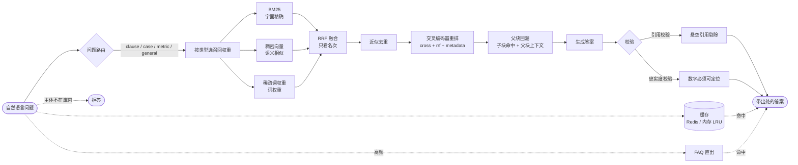
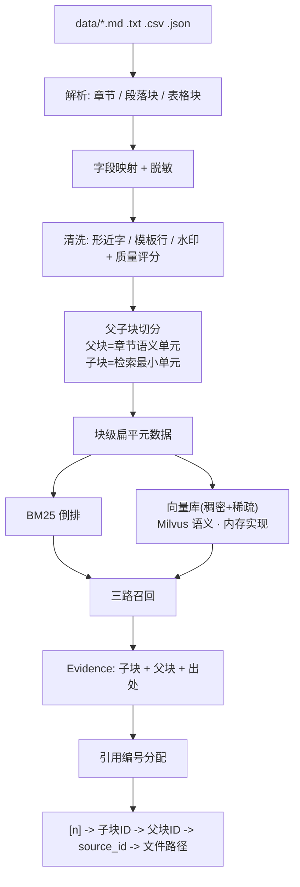

# FinRAG-Engine · 金融智研引擎（RAG）

> 面向银行、证券机构的**可溯源检索增强问答引擎**：把散落在不同系统、格式复杂的金融资料
> 做「解析清洗 → 父子块切分 → 三路混合召回 → 交叉编码器重排 → 引用溯源输出」，
> 答案里的每一个 `[n]` 都能一路回溯到**原文条款 + 资料编号 + 更新日期 + 版本号**。
> **不配 API Key、不装 Milvus / Redis / BGE-M3 / OCR，也能完整跑通**（自动降级为确定性本地后端）。

<p align="left">
  
  
  
  
  
  
</p>

---

## 一、这是什么

给定一句自然语言问题（例如「年满 65 周岁的客户购买 R3 产品有哪些额外要求？」），系统会：

1. **路由**问题类型（条款 / 案例 / 指标 / 通用），并按类型选择召回权重；
2. **多路召回**同一批子块：BM25（字面）、稠密向量（语义）、稀疏词权重；
3. **RRF 融合**三路排名（只看名次，规避量纲不一致）；
4. **去重 + 交叉编码器重排**，把真正有用的证据排到前面；
5. **父块回溯**：命中子块，取回父块上下文一起交给模型；
6. **生成带引用编号的答案**，并做**引用校验**与**数字忠实度校验**；
7. 资料库里没有依据时**拒答**（包括"问的主体不在库里"这种情况）。

产出的答案：

```
【结论】
条件项: 金融资产；标准: 不低于 300 万元。 [1]

【依据】
- （条款/表格｜示例监管机构 · 资产管理产品适当性管理办法 · 第五章 合格投资者准入）… [1]
- （原文｜…）… [2]

【出处与时效】
[1] 示例监管机构 · 资产管理产品适当性管理办法 · 第五章 合格投资者准入
    （资料编号 POL-2024-07，更新/生效日期 2024-07-01，版本 v2）
```

### 核心特性

| 能力 | 实现 |
| --- | --- |
| 多源解析 | `.md` / `.txt`(OCR 稿) / `.csv` / `.json` 统一解析成「章节 → 段落块 / 表格块」 |
| 字段映射 | `机构名称` / `institution_name` / `org` 等异名字段统一映射到规范字段 |
| 清洗 | OCR 形近字纠正、数字上下文字母归正、水印与页眉页脚剔除、文档质量评分 |
| 脱敏 | 身份证 / 手机号 / 银行卡 / 邮箱在**入库前**脱敏，日志与轨迹不含原始串 |
| OCR | 可插拔后端：`paddleocr`（生产）/ `sidecar` 旁挂校对文本（离线）/ `null`（如实报缺） |
| 切分 | **按文档结构**父子块切分；表格**成组切**并重复表头；子块带重叠 |
| 元数据 | 块级扁平元数据 + Milvus 风格过滤表达式（`doc_type = "监管政策" AND year >= 2024`） |
| 三路召回 | 手写 BM25 + 确定性/真实稠密向量 + 稀疏词权重，**按问题类型配权重** |
| 融合 | RRF（只看名次），并对"三路共识"给轻微加成 |
| 重排 | bge-reranker 语义的可插拔接口；本地实现把 6 个可解释特征显式拆出 |
| 引用 | 编号只由 CitationLedger 签发；**悬空引用（幻觉编号）当场剔除并记录** |
| 忠实度 | 答案中的每个数字必须能在证据中定位；句子支撑率、答案相关性均为确定性计算 |
| 拒答 | 无证据拒答 + **主体闸门**（问题里的公司不在库内 → 拒答，不做张冠李戴） |
| FAQ | 高频问题直出；带**标识符一致性闸门**，防止近似问题被抢答 |
| 缓存 | Redis 兼容；无 Redis 降级内存 LRU；**缓存键包含全部影响结果的参数** |
| 服务 | FastAPI 接口；另附 `src/serve.py` stdlib 兜底服务（零额外依赖也能起服务） |
| 可观测 | 每步一行 JSONL（step / input_digest / output_digest / latency_ms / status）+ 轨迹汇总 |
| 评估 | 10 条检索生成用例 + 2 条拒答用例 + 10 条 FAQ 用例，11 项指标，不达标退出码 1 |
| 测试 | **267 个 pytest 用例全绿**，全程离线、可复现 |

> ⚠️ **数据声明**：`data/` 下的机构、产品、案例、财务数据**全部虚构**
> （「示例监管机构」「示例银行股份有限公司」「示例基金管理有限公司」「示例集团股份有限公司」），
> 与任何真实主体无关。本项目仅用于技术演示，不构成投资建议。

---

## 二、业务背景：金融资料的三个特征

**第一，来源散、格式杂。** 研究报告、产品说明、监管政策、尽调与信贷档案、风险案例、内部制度
分布在不同系统，格式从 PDF、Word、Excel 到扫描图片都有。

**第二，更新频繁且需要留档。** 监管政策与内部制度会修订，旧版本还要能查到
（"2023 年的标准是多少"必须答得出 200 万元，而不是拿新版的 300 万元糊弄过去）。

**第三，提问是"人话"，答案却要求很硬。** 业务人员要拿回答去复核，
复核的第一步就是顺着引用回到原文；答案里出现一个编造的数字，整个系统的可信度就没了。

这就决定了三件事：**解析必须扛得住脏数据、检索必须兼顾字面与语义、输出必须带出处与时效。**

---

## 三、系统总览



### 索引与检索的数据流



---

## 四、六个关键设计取舍

### 4.1 为什么用 RRF 而不是加权求和

BM25 的分数无界（可以到 20+），余弦相似度在 `[-1, 1]`，稀疏点积又是另一个量纲。
加权求和必须先做 min-max 归一化，而**归一化依赖候选集内的极值**：换一批候选，
同一个块的相对高低就可能反转，检索结果因此不稳定。

RRF 只用名次：`score = Σ w_r / (k + rank_r)`。它天然免疫量纲不一致，跨越不同查询也更稳。

### 4.2 为什么按问题类型配权重

「第四条怎么规定的」要的是**字面精确**（BM25 权重最高）；
「有没有类似的处罚案例」要的是**语义相似**（稠密权重最高）；
「集中度上限是多少」要的是**条款里的数字**（字面 + 词权重并重）。

一套权重打不通所有场景。路由还同时改变**排序先验**：
问条款时优先看监管政策与内部制度，问案例时优先看风险案例与尽调档案。

> 实测效果：加入路由 + 路由感知重排后，**首位命中率 50% → 80%，MRR 0.68 → 0.90**。

### 4.3 元数据过滤：显式硬过滤，推断软加权

| 来源 | 强度 | 原因 |
| --- | --- | --- |
| 用户显式给的 `expr` | **硬过滤**（召回前剔除） | 用户说了算，比如"只看 2023 年版本" |
| 从问题里推断出的机构 / 资料类型 | **软加权**（只影响排序） | 推断可能错，硬过滤会静默丢证据 |
| 显式年份 + 版本语境 | **有条件提升为硬过滤** | 仅当资料库确实存在该年份版本时才提升 |

最后一条是本项目最有意思的一个坑：问「**2023 年**的合格投资者标准」时，不做硬过滤，
新版规定因为用词更贴近、篇幅更大，会排到旧版前面，答案就变成"2023 年的标准是 300 万元"——
**时效性错误**，金融场景里的硬伤。

但「示例集团 **2023 年**应收账款增速」里的年份限定的是**财务数据年度**，不是文档版本；
一旦硬过滤，当期的尽调档案会被整体筛掉。所以用 `_YEAR_VERSION_RE`
区分「年份 + 标准/规定/办法/条款」与「年份 + 财务指标」两种句式。

### 4.4 表格必须成组切

一个表格行块 = **表头 + N 行数据**，且**每一行都重复表头**。
把表头和数据行拆到不同块里，「R4 产品不得推荐给 C3 客户」这条信息就永远拼不回来；
不重复表头，模型看到 `730 | 100 | 4.80%` 只能靠猜。

同理，表格子块在生成阶段按**整块**参与选句，不再按「；」拆句——
否则引用出来的是「条件项: 金融资产；」这种没头没尾的半句。

### 4.5 反幻觉做成结构，而不是提示词

提示词里写"不要编造"只是第一道防线，**第二、第三道必须是确定性的**：

| 防线 | 机制 | 失败表现 |
| --- | --- | --- |
| 数字 | 抽取式作答只搬运原文；真实模型路径再过 `check_numbers` | 答案里的数字无法在证据中定位 |
| 引用 | `CitationLedger` 独家签发编号，`validate()` 剔除悬空编号 | 出现 `[7]` 这种不存在的出处 |
| 主体 | 主体闸门：问题里的公司不在库内直接拒答 | 拿 B 公司的数字回答 A 公司的问题 |
| FAQ | 标识符一致性闸门：问题里的 `C2`/`R2`/代码必须出现在 FAQ 条目里 | 「C2 能买什么」被「R2 能卖给 C1 吗」抢答 |

### 4.6 降级不是"跑不起来的分支"，而是**同一套接口的另一个实现**

| 组件 | 生产 | 本地 / CI | 切换点 |
| --- | --- | --- | --- |
| 向量库 | Milvus | 内存实现（同 `insert/search/query` 语义） | `index/vector_store.py` |
| 向量模型 | BGE-M3（稠密 + 稀疏） | 确定性哈希后端 | `EMBED_BACKEND` |
| 重排 | bge-reranker | 本地交叉编码器（6 个可解释特征） | `get_reranker()` |
| 缓存 | Redis | 内存 LRU（含 TTL / 淘汰统计） | `REDIS_URL` |
| OCR | PaddleOCR | 旁挂校对文本 / 如实报缺 | `ingest/ocr.py` |
| 生成 | OpenAI 兼容接口 | 确定性抽取式作答 | `OPENAI_API_KEY` |

因此引擎代码里**不存在「没装 XX 就跑不了」的分支**，上层逻辑一行都不用改。

---

## 五、快速开始

### 5.1 安装

```bash
pip install -r requirements.txt          # 完整依赖（含 FastAPI / Redis / BGE-M3 / PaddleOCR）
pip install numpy pydantic pytest        # 只想跑核心链路与测试：这三个就够
```

### 5.2 跑一次问答（零依赖，离线）

```bash
python -m src.demo
```

Windows PowerShell 建议显式指定 UTF-8，避免中文乱码：

```powershell
$env:PYTHONIOENCODING="utf-8"; python -m src.demo
```

常用参数：

```bash
python -m src.demo --question "年满 65 周岁的客户购买 R3 产品有哪些额外要求？"
python -m src.demo --compare                    # 单一向量 / 纯关键词 / 混合三路 现场对比
python -m src.demo --stats                      # 只看引擎体检
python -m src.demo --expr 'year = 2023'         # 元数据硬过滤
python -m src.demo --mode dense                 # 用单一向量做对照
python -m src.demo --no-faq                     # 关掉 FAQ 直出
python -m src.demo --json runs/demo.json
```

### 5.3 起服务

```bash
# 有 FastAPI：正式接口（含 OpenAPI 文档）
python -c "from src.api import serve; serve()"

# 没 FastAPI：stdlib 兜底服务，零额外依赖
python -m src.serve --port 8000
```

```bash
curl -s http://127.0.0.1:8000/health
curl -s -X POST http://127.0.0.1:8000/ask -H "Content-Type: application/json" \
  -d '{"question":"合格投资者的金融资产门槛是多少？","top_k":5}'
curl -s -X POST http://127.0.0.1:8000/search -H "Content-Type: application/json" \
  -d '{"question":"双录","expr":"doc_type = \"监管政策\""}'
```

### 5.4 评测

```bash
python eval/run_eval.py                 # 完整评测（含单一向量 / 纯关键词对照）
python eval/run_eval.py --no-baseline   # 跳过对照，快一些
python eval/run_eval.py --verbose       # 打印每条用例的失败明细
```

退出码非 0 表示核心指标未达标，可直接卡 CI。

### 5.5 测试

```bash
python -m pytest -q          # 267 passed
```

### 5.6 换真实后端

```bash
# .env（或直接设环境变量）
OPENAI_API_KEY=sk-xxxx
OPENAI_BASE_URL=https://api.openai.com/v1
MODEL_NAME=gpt-4o-mini

EMBED_BACKEND=bge-m3          # 装了 FlagEmbedding 后启用真实 BGE-M3（稠密 + 稀疏）
REDIS_URL=redis://127.0.0.1:6379/0

# 强制离线回归（即使配了 key 也走确定性路径）
MOCK_LLM=1
```

---

## 六、目录结构

```
项目_金融智研引擎RAG/
├── README.md
├── requirements.txt
├── pytest.ini / conftest.py
├── Dockerfile / docker-compose.yml / .env.example
├── data/                         # 虚构资料库（10 篇文档 + 10 条 FAQ）
│   ├── 01_POL-2024-07_资产管理产品适当性管理办法.md
│   ├── 02_POL-2023-11_适当性管理暂行规定_已废止.md
│   ├── 03_PROD-WY2024-01_稳赢系列产品说明书.md
│   ├── 04_INS-2024-09_客户适当性管理实施细则.md
│   ├── 05_CASE-2024-03_适当性违规案例汇编.md
│   ├── 06_RPT-2024-06_固定收益市场月报.md
│   ├── 07_DD-2024-05_示例集团尽调档案.md
│   ├── 08_OCR-2023-12_信贷合规检查要点.txt      # 带 OCR 错字与页眉页脚
│   ├── 09_PRODUCTS_在售产品要素表.csv
│   ├── 10_PRODUCTS_产品库结构化导出.json
│   └── 11_FAQ_高频问题库.json
├── src/
│   ├── config.py                 # 全部可调参数（含三路权重、路由权重、阈值）
│   ├── ingest/                   # 解析 / 字段映射 / 清洗 / 脱敏 / OCR
│   ├── chunking/                 # 父子块切分 + 元数据 + 过滤表达式求值器
│   ├── index/                    # BM25 / 稠密+稀疏向量 / Milvus 语义内存向量库
│   ├── retrieve/                 # 路由 / 三路召回+RRF / 重排 / 流水线
│   ├── answer/                   # 引用账本 / 生成 / 忠实度校验 / LLM 客户端
│   ├── cache/                    # Redis 兼容 + 内存 LRU
│   ├── faq.py                    # 高频问题直出
│   ├── engine.py                 # 主入口（装配 + 问答编排 + 主体闸门 + 缓存）
│   ├── api.py / serve.py         # FastAPI 接口 / stdlib 兜底服务
│   ├── tracing.py                # 每步一行 JSONL
│   └── demo.py                   # 命令行演示
├── eval/
│   ├── cases.json                # 10 条检索生成 + 2 条拒答 + 10 条 FAQ 用例
│   ├── run_eval.py
│   └── last_report.json          # 最近一次评测明细
├── runs/                         # 每次问答的 JSONL 轨迹
└── tests/                        # 267 个用例
    ├── test_ingest.py            # 解析 / 清洗 / 脱敏 / OCR
    ├── test_chunking.py          # 切分 / 表格成组 / 元数据过滤
    ├── test_index.py             # BM25 / 向量 / 向量库
    ├── test_retrieve.py          # 路由 / 三路召回 / RRF / 去重 / 重排 / 流水线
    ├── test_answer.py            # 引用账本 / 抽取式作答 / 拒答 / 忠实度
    ├── test_cache_faq.py         # 缓存键与降级 / FAQ 闸门
    ├── test_engine_api.py        # 引擎 / 接口 / 轨迹 / 兜底 HTTP 服务
    └── test_eval.py              # 指标函数 + 端到端评测
```

---

## 七、真实跑出来的评测结果

资料库规模：**10 篇文档 / 53 个章节 / 19 张表格 / 52 个父块 / 163 个子块（表格子块 54）**，
BM25 词表 3052 词。全程 mock 模式，`python eval/run_eval.py` 可复现。

| 指标 | 结果 | 说明 |
| --- | --- | --- |
| 检索命中率 | **100.00%** | 混合三路（按分组标注的标准来源） |
| 对照·单一向量（不重排） | 90.00% | 同一批用例 |
| 对照·纯关键词 BM25（不重排） | 100.00% | 说明字面匹配在金融语料上很强，语义路补的是另一类问题 |
| 复杂问题召回率提升 | **+11.11%** | 混合三路 + 重排 vs 单一向量不重排 |
| 首位命中率 | **80.00%** | 对照·单一向量 50.00% |
| MRR | **0.9000** | 对照·单一向量 0.6833 |
| 引用可追溯率 | **100.00%** | 答案里每个 `[n]` 都能回到真实证据 |
| 答案相关度（要点覆盖率） | **100.00%** | 人工标注必答要点的覆盖比例 |
| 数字忠实度 | **100.00%** | 答案中的数字均可在证据中定位 |
| 句子支撑率 | 98.57% | 答案句子被证据支撑的比例 |
| 路由命中率 | 87.50% | 问题类型识别正确率 |
| 拒答正确率 | **100.00%** | 资料库没有的主体，一律拒答，不编造 |
| FAQ 命中准确率 | **100.00%** | 8 条应命中 + 2 条不应命中 |
| 平均耗时 | **26.4 ms** | 最小 17.6 / 最大 33.6 |
| 缓存命中耗时 | **0.6 ms** | 第二轮同问题 |
| 单元测试 | **267 passed** | 全程离线、可复现 |

> 关于上表的诚实说明：本地向量后端是**确定性哈希向量**（本质是词面加权），
> 它在字面匹配上比真实语义 embedding 强得多，所以"单一向量"这个对照组的成绩被抬高了。
> 换成真实 BGE-M3 后，稠密向量对条款号、产品代码、金额这类精确元素的短板会暴露得更充分，
> 混合三路的优势会明显大于这里的 +11.11%。**这里报的是能复现的真实数字，不是宣传数字。**

---

## 八、技术难点与解决方案

| 技术难点 | 为什么难 | 解决方案 |
| --- | --- | --- |
| 金融资料格式复杂、质量参差 | 同一制度有多个版本；扫描件有 OCR 误差；页眉页脚与水印穿插 | 解析层统一成「章节 + 段落块 / 表格块」；形近字与数字上下文纠错；模板行与水印剔除；文档质量评分并传导到重排降权 |
| 制度条款与风险案例对排序要求相反 | 一种检索策略无法同时满足 | 问题类型路由 → 三路权重 + 排序先验；RRF 融合只看名次 |
| 长文档语义切分不完整、答案缺出处 | 切太碎丢上下文，切太大命中不准 | 父子块切分（子块命中 + 父块回溯）；表格成组切且重复表头；引用编号独家签发并校验悬空 |
| 三路分数不可比 | BM25 无界、余弦有界、稀疏点积另一套量纲 | RRF 只用名次；重排再与 RRF 分、元数据契合度加权融合 |
| 过滤条件写错会静默丢证据 | 过滤错误不报错，只是答案悄悄变差 | 手写过滤表达式求值器（可单测）；推断条件只做软加权；年份仅在"库内确有该版本"时提升为硬过滤 |
| 时效性与版本混淆 | 旧版新规措辞更贴近，容易把 2023 年的问题答成 2024 年的标准 | `_YEAR_VERSION_RE` 区分"年份限定版本"与"年份限定财务数据"；引用里强制带更新日期与版本 |
| 幻觉（编数字、编引用） | 提示词约束不可靠 | 抽取式作答只搬运原文；真实模型路径过 `check_numbers` 与 `CitationLedger.validate()`；主体闸门拦住张冠李戴 |
| 缓存返回过期结果 | 只按问题文本做键，加了过滤条件仍命中旧缓存 | 缓存键包含问题 + 过滤表达式 + TopK + 检索模式 + 路由 |
| 响应速度 | 三路召回 + 重排 + 生成 | Redis/内存缓存（命中 0.6 ms）；FAQ 直出高频问题；重排只对去重后的少量候选做 |
| 线上问题难定位 | 只看到最终答案，看不到中间过程 | 每步一行 JSONL（含 digest 与耗时）+ `summarize_trace()` 汇总 + 评测脚本按段量化 |

---

## 九、面试可能被追问的几个点

**Q：为什么要混合检索，单一向量不行吗？**
向量擅长"意思相近"，不擅长精确匹配。金融场景大量问题涉及条款号、产品代码、指标名称
（"资管新规""R2""第四十二条""WY2024-01"），这些用字面匹配比向量可靠得多；
但纯关键词也不行，因为业务人员的提问是自然语言。所以三路并行、按问题类型配权重。

**Q：RRF 和加权求和差在哪？**
加权求和要先归一化，而归一化依赖候选集内的极值——换一批候选，相对高低可能反转。
RRF 只看名次，天然免疫量纲不一致，跨查询也更稳。

**Q：怎么证明优化真的有效？**
评测脚本里同时跑三套策略（单一向量 / 纯关键词 / 混合三路+重排），指标是分段的：
检索段看命中率与 MRR，生成段看引用可追溯率、要点覆盖率、数字忠实度。
退出码非 0 直接卡 CI，所以"变好还是变坏"不靠感觉。

**Q：答案里的出处是怎么保证可追溯的？**
引用编号只由 `CitationLedger` 签发，一个子块占一个编号；答案输出前做一次校验，
不在账本里的编号（模型编的）当场剔除并记入 `dropped`。
ID 链路是 `[n] → Citation → child_id → parent_id → source_id → 文件路径`，任何一环断了都会被测试拦住。

**Q：资料里没有的问题怎么办？**
三种兜底：没有可用证据 → 拒答；问题里提到的公司不在资料库主体清单 → 主体闸门拒答
（这是金融场景最危险的错误——拿 B 公司的数字回答 A 公司）；高频问题 → FAQ 直出，
但带标识符一致性闸门，防止"C2 能买什么"被"R2 能卖给 C1 吗"抢答。

**Q：这套东西上生产要改什么？**
README 第四节 4.6 列了六处替换点，都是同接口换实现：Milvus / BGE-M3 / bge-reranker /
Redis / PaddleOCR / OpenAI 兼容模型。此外需要补的是权限体系、多租户隔离、
文档增量更新与索引重建流程、以及更大规模的评测集。

---

## 十、Docker

```bash
docker compose up -d          # 起 Milvus / Redis / MySQL 与引擎服务
docker build -t finrag-engine .
docker run --rm -p 8000:8000 finrag-engine
```
