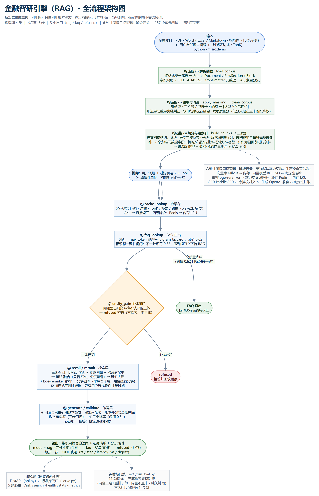

# 金融智研引擎（RAG）· 全流程架构图

> 本文件由项目代码反向核对后整理：链路顺序、出口模式、阈值与降级开关均取自
> `src/engine.py`（构造期 / 提问期两段）、`src/answer/`、`src/retrieve/`、
> `src/cache/redis_cache.py`、`src/config.py`，与代码一致。

## 一句话定位

**反幻觉做成结构**：引用编号只由引用账本签发、输出前校验，账本外编号当场剔除；确定性的事（脱敏、切分、融合、忠实度判定）不交给模型。

## 链路两段（与代码一一对应）

| 阶段 | 步骤 |
| --- | --- |
| **构造期**（启动一次） | `load_corpus` → `apply_masking` → `clean_corpus` → `build_chunks` → 三索引（BM25 / 稠密+稀疏向量 / FAQ） |
| **提问期** | ① `cache_lookup` → ② `faq_lookup` → ③ `entity_gate` → ④ `recall/rerank` → ⑤ `generate/validate` |
| **出口** | `mode = rag` ｜ `faq`（FAQ 直出）｜ `refused`（主体闸门/无证据拒答） |
| **耗时埋点** | `cache_ms / faq_ms / entity_gate_ms / retrieval_ms / generate_ms / verify_ms / total_ms`（没走到的步骤就没有对应键） |

## 六处「同接口换实现」降级开关

| 环节 | 生产后端 | 离线默认实现 |
| --- | --- | --- |
| 向量库 | Milvus | 内存集合（`MilvusLiteClient`） |
| 向量模型 | BAAI/bge-m3 | 确定性哈希向量 |
| 重排 | bge-reranker | 本地交叉编码器 |
| 缓存 | Redis | 内存 LRU |
| OCR | PaddleOCR | 旁挂校对文本 |
| 生成 | OpenAI 兼容 | 确定性抽取式 |

## 主流程图（Mermaid 源码）

```mermaid
flowchart TD
    IN(["<b>输入</b><br/>金融资料：PDF / Word / Excel / Markdown / 扫描件（10 篇示例）<br/>+: 用户自然语言问题（+ 过滤表达式 / TopK）<br/>python -m src.demo"]) --> B1

    B1["<b>构造期 ① 解析装载</b>　load_corpus<br/>多格式统一解析 → SourceDocument / RawSection / Block<br/>字段映射（FIELD_ALIASES）· front-matter 元数据 · FAQ 条目分流"]
    B2["<b>构造期 ② 脱敏与清洗</b>　apply_masking → clean_corpus<br/>身份证 / 手机号 / 银行卡 / 邮箱 → [类型:****后四位]<br/>形近字与数字夹缝纠正 · 水印与模板行剔除 · 六项质量分（低分文档在重排阶段降权）"]
    B3["<b>构造期 ③ 切分与建索引</b>　build_chunks → 三索引<br/>按<b>文档结构</b>切：父块=语义完整章节 · 子块=段落/表格行组；<b>表格成组且每行重复表头</b><br/>补 17 个多维元数据字段（机构/产品/行业/年份/版本/密级…）作为召回前过滤条件<br/>→ BM25 倒排 + 稠密/稀疏向量集合 + FAQ 索引"]

    Q(["<b>提问</b>：用户问题 + 过滤表达式 + TopK<br/>（引擎惰性单例，构造期只跑一次）"]) --> S1
    S1["<b>① cache_lookup</b>　查缓存<br/>缓存键含 问题 / 过滤 / TopK / 模式 / 路由（blake2b 摘要）<br/>命中 → 直接返回；四级降级：Redis → 内存 LRU"]
    S2["<b>② faq_lookup</b>　FAQ 直出<br/>词面 = max(token 覆盖率, bigram Jaccard)，阈值 0.62<br/><b>标识符一致性闸门</b>：不一致惩罚 0.35，压到阈值之下转 RAG"]
    S3{"<b>③ entity_gate 主体闸门</b><br/>问题里出现资料库不认识的主体<br/>→ <b>refused 拒答</b>（不检索、不生成）"}
    S4["<b>④ recall / rerank</b>　检索层<br/>三路召回：BM25 字面 + 稠密向量 + 稀疏词权重<br/>→ <b>RRF 融合</b>（只看名次、免疫量纲）→ 近似去重<br/>→ bge-reranker 精排 → 父块回溯（排序看子块、喂模型看父块）<br/>软加权绝不剔除候选；只有用户显式条件才硬过滤"]
    S5["<b>⑤ generate / validate</b>　作答层<br/>引用编号只由<b>引用账本</b>签发，输出前校验，账本外编号当场剔除<br/>数字忠实度（三步口径）+ 句子支撑率（阈值 0.34）<br/>无证据 → 拒答；校验通过才对外"]
    OUT(["<b>输出</b>：带引用编号的答案 + 证据清单 + 分步耗时<br/>mode = <b>rag</b>（完整检索+生成）｜ <b>faq</b>（FAQ 直出）｜ <b>refused</b>（拒答）<br/>每步一行 JSONL 轨迹（ts / step / latency_ms / digest）"])

    B1 --> B2 --> B3 --> Q
    Q --> S1 --> S2 --> S3
    S3 -->|"主体已知"| S4
    S3 -->|"主体未知"| REF(["<b>refused</b><br/>拒答并回填缓存"])
    S2 -->|"高质量命中<br/>（阈值 0.62 且标识符一致）"| FAQOUT(["<b>FAQ 直出</b><br/>回填缓存后直接返回"])
    S4 --> S5 --> OUT

    SW["<b>六处「同接口换实现」降级开关</b>（离线默认本地实现，生产换真实后端）<br/>向量库 Milvus ↔ 内存 · 向量模型 BGE-M3 ↔ 确定性哈希<br/>重排 bge-reranker ↔ 本地交叉编码器 · 缓存 Redis ↔ 内存 LRU<br/>OCR PaddleOCR ↔ 旁挂校对文本 · 生成 OpenAI 兼容 ↔ 确定性抽取"]
    SRV["<b>服务层（同契约两形态）</b><br/>FastAPI（api.py）↔ 标准库兜底（serve.py）<br/>5 条路由：/ask /search /health /stats /metrics"]
    EVAL["<b>评估与门禁</b>　eval/run_eval.py<br/>11 项指标 + 三套检索策略对照<br/>（混合三路+重排 / 单一向量不重排 / 纯关键词）<br/>不达标以退出码 1 卡 CI"]

    B3 -.-> SW
    OUT -.-> SRV
    OUT -.-> EVAL

    classDef input fill:#EAF2FE,stroke:#5B8FD9,stroke-width:2px,color:#12314E;
    classDef build fill:#F0F6F1,stroke:#8FBF9A,stroke-width:1.6px,color:#1d3b26;
    classDef step fill:#F4F8FD,stroke:#9FBFDD,stroke-width:1.6px,color:#12314E;
    classDef gate fill:#FFF3E0,stroke:#E8A33D,stroke-width:2.4px,color:#5a3708;
    classDef output fill:#E8F4EA,stroke:#5E9E6B,stroke-width:2.2px,color:#12351f;
    classDef note fill:#FBFBFB,stroke:#C7CFD8,stroke-width:1.2px,color:#41505f;
    classDef bad fill:#FDEAEA,stroke:#D96A6A,stroke-width:1.8px,color:#5c1a1a;
    class IN,Q input;
    class B1,B2,B3 build;
    class S1,S2,S4,S5 step;
    class S3 gate;
    class OUT,FAQOUT output;
    class SW,SRV,EVAL note;
    class REF bad;
```

## 关键设计约束

| 约束 | 代码位置 | 说明 |
| --- | --- | --- |
| 引用编号只由账本签发 | `src/answer/citations.py` | 账本外编号当场剔除并记入 `_dropped` |
| 确定性的事不交给模型 | `src/answer/faithfulness.py` | 数字忠实度与句子支撑率都是纯函数判定 |
| 硬过滤 vs 软加权 | `src/retrieve/` | 只有用户显式条件才硬过滤；模型推断的只做软加权（加错过滤比不过滤更危险） |
| RRF 而非加权求和 | `src/retrieve/hybrid.py` | 只看名次，免疫 BM25/余弦/点积的量纲差异 |
| 评估即门禁 | `eval/run_eval.py` | 指标不达标以退出码 1 卡 CI |
