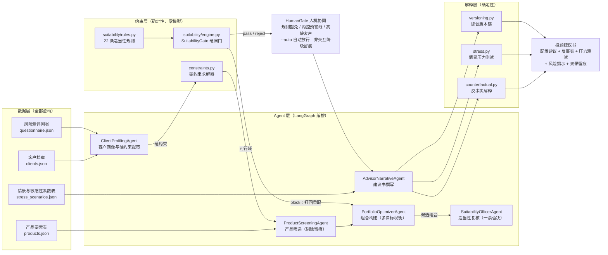
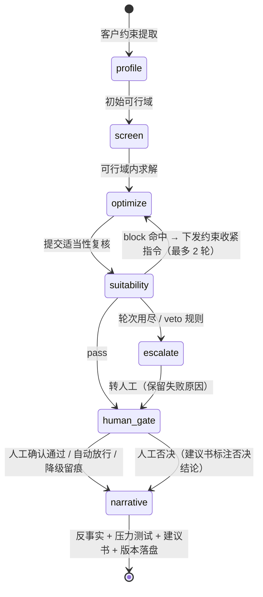
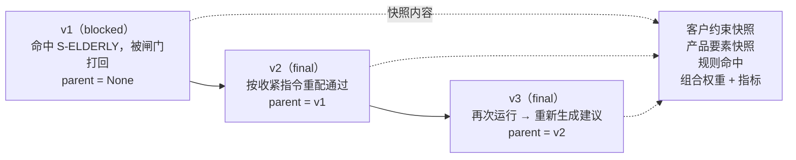
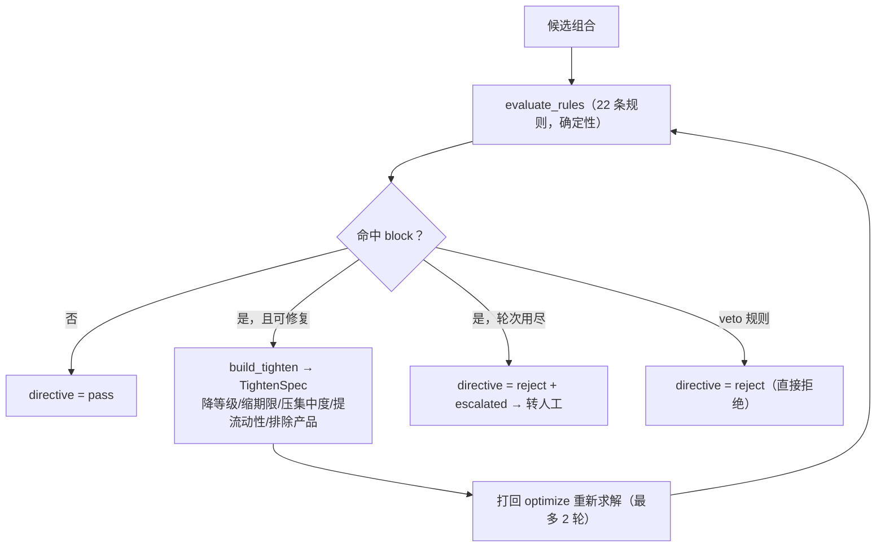

# 财富管理投顾多智能体（Wealth Advisory Multi-Agent）

> **约束驱动（constraint-driven）**：先把客户的硬约束求解成可行域，再让 Agent 在可行域内做多目标权衡与解释。
> 核心机制是 **硬约束求解 + 适当性闸门 + 反事实解释 + 情景压力测试 + 建议版本链**。

一个可直接运行的开源作品集项目：5 个职责互斥的 Agent、22 条适当性规则、双编排引擎（LangGraph / 零依赖降级）、
291 个 pytest 用例、无 API Key 也能完整跑通的 mock 模式。
**全部客户与产品均为虚构数据，不构成任何投资建议。**

---

## 0. 这不是什么

- ❌ 不是"让大模型自由发挥选基金"——所有权重与合规结论都来自**确定性代码**，模型只负责组织措辞；
- ❌ 不是投研文档问答——本项目**不检索文档**，数据对象是"客户档案 + 风险测评问卷 + 产品要素表"；
- ❌ 不是事后合规检查——适当性闸门是**前置硬闸门**，不通过就**打回重配**，而不是出了报告再打补丁。

## 1. 三条技术路线的定位

本项目刻意与作者已有的两个项目走**第三条路线**，避免换皮：

| 维度 | 项目一：金融投研多智能体 | 项目二：金融合规反洗钱多智能体 | **本项目：财富管理投顾多智能体** |
| --- | --- | --- | --- |
| 核心命题 | 把文档里的数字查准 | 把交易里的可疑挑出来 | **在客户约束下配出合适组合并讲清为什么** |
| 驱动方式 | 文档驱动（RAG） | 交易驱动（规则引擎） | **约束驱动（可行域求解）** |
| 数据对象 | 非结构化文档 | 交易流水 | **客户档案 + 风险测评问卷 + 产品要素表** |
| 关键机制 | 检索 → 分析 → 反思循环打回重算 | 规则告警 → 分诊调查 → 证据固化 | **硬约束求解 → 适当性闸门 → 反事实 → 压力测试** |
| 打回语义 | 反思：让模型"再想想" | 四眼复核：换个签名再看一遍 | **约束收紧：缩小可行域后重新求解（数学上必然收敛）** |
| 追溯方式 | 引用编号 → 原文 | append-only 哈希链审计账本 | **客户约束快照 + 建议版本链（version chain）** |
| 产出物 | 投研简报 | 可疑交易报告 | **投顾建议书（含风险揭示与双录留痕标记）** |
| 决策主体 | 模型为主 | 规则为主 | **规则/求解器为主，模型只做措辞** |

一句话概括差异：**项目一在"信息"上做文章，项目二在"事后"做文章，本项目在"约束空间"上做文章。**

## 2. 架构总览



## 3. 状态流转



> `human_gate` 位于**建议书定稿之前**：未取得人工确认（或被人为否决）时，最终状态不会是正常定稿，
> 从流程上保证「必须人工确认后才能定稿」。

## 4. 建议版本链



每个版本是一份**不可变快照**：内部只保存规范化 JSON 文本与其 SHA-256，
调用方拿到的 `payload` 是每次重新解析的新对象，改它不会污染历史版本。

## 5. 核心机制

### 5.1 硬约束求解器（`src/constraints.py`）

把客户档案翻译成可执行的纯函数检查，三条不可动摇的性质（均有单测）：

1. **纯函数**：只读输入，不修改传入对象；
2. **确定性**：同样的输入永远返回同样的输出，连顺序都一致；
3. **幂等**：`f(f(x)) == f(x)`，重复调用不累积副作用。

| 原因码 | 含义 |
| --- | --- |
| `C-RISK` | 产品风险等级高于客户风险承受等级 |
| `C-HORIZON` | 产品期限超过客户投资期限 |
| `C-PROHIBITED-CLASS` / `C-PROHIBITED-PRODUCT` | 命中客户禁止项（类别 / 具体产品） |
| `C-DERIVATIVE-BAN` | 客户禁止衍生品，但产品含衍生品结构 |
| `C-CURRENCY` | 币种与客户偏好不一致 |
| `C-EXPERIENCE` | 客户不具备产品所要求品类的投资经验 |
| `C-ENTRY` / `C-ENTRY-MIN` | 起投金额超过可投金额 / 配置金额低于起投金额 |
| `C-QUALIFIED` | 合格投资者专属产品，客户不满足准入 |
| `C-CONC-SINGLE` / `C-CONC-CLASS` / `C-CONC-ISSUER` | 单一产品 / 单一类别 / 同一发行人集中度超限 |
| `C-LIQUIDITY` | 流动性资产占比低于客户下限 |
| `C-WEIGHT-SUM` / `C-WEIGHT-NEG` | 权重合计超 100% / 出现负权重 |

关键接口：`check_portfolio(portfolio, client)` → 违反项列表；`screen_products(client, products)` → 候选池 + 逐条剔除原因；
`TightenSpec.apply(client)` → 按闸门指令**单调收紧**约束（只会更严，因此多轮打回必然收敛）。

**组合构建的可行性保证**：`build_portfolio` 内部有确定性修复循环，最后兜底是把剩余权重全部放进现金
（现金不存在任何约束违反），因此"被接受的组合约束违反数恒为 0"是**结构性保证**而非概率事件。

### 5.2 适当性规则库（`src/suitability/rules.py`，22 条）

| 规则号 | 名称 | 级别 | 触发条件 |
| --- | --- | --- | --- |
| `S-RISK-MATCH` | 风险等级匹配 | block | 任一持仓产品风险等级 > 客户风险承受等级 |
| `S-HORIZON` | 投资期限匹配 | block | 产品期限 > 客户投资期限 |
| `S-CONC-SINGLE` | 单一产品集中度上限 | block | 单产品权重 > 客户约定上限 |
| `S-CONC-CLASS` | 单一资产类别上限 | block | 同类合计权重 > 约定上限 |
| `S-CONCENTRATION-ISSUER` | 同一发行人上限 | block | 同一发行主体合计权重 > 约定上限 |
| `S-LIQUIDITY` | 流动性需求满足 | block | 流动性资产占比 < 客户下限 |
| `S-ENTRY` | 起投金额匹配 | block | 起投金额 > 可投金额，或配置金额 < 起投金额 |
| `S-ELDERLY` | 高龄客户特别保护 | block | 年满 65 岁且持有 R4 及以上产品，或单产品集中度 > 20% |
| `S-EXPERIENCE` | 投资经验匹配 | block | 客户缺少产品所要求品类的经验 |
| `S-DERIVATIVE-BAN` | 衍生品禁止项 | block | 客户排除衍生品但组合含衍生品结构 |
| `S-CURRENCY` | 币种匹配 | block | 产品币种 ≠ 客户偏好币种 |
| `S-QUALIFIED` | 合格投资者准入 | block | 专属产品卖给非合格投资者 |
| `S-PROHIBITED` | 禁止项清单 | block | 命中客户禁止清单（类别或产品） |
| `S-WEIGHT` | 权重合法性 | block | 权重合计 > 100% 或存在负权重 |
| `S-FEASIBLE-POOL` | 可行域非空 | block（**veto**） | 硬约束下无任何可投产品，直接拒绝 |
| `S-DUAL-RECORD` | 双录留痕 | warn | 高龄 / R4 及以上 / 衍生品结构，且未完成双录 |
| `S-FEE-DISCLOSE` | 费率揭示 | warn | 组合综合费率 > 客户费率预算 |
| `S-TAX` | 税收优惠额度 | warn | 税收优惠型产品金额 > 客户可用额度 |
| `S-COOLING` | 冷静期提示 | warn | 期限 ≥ 1 年且可即时变现比例 < 30% |
| `S-CONCENTRATION-WARNING` | 内控集中度预警线 | warn | 单产品权重 > 内控预警线（触发人工确认） |
| `S-CASH-RESERVE` | 现金缓冲建议 | warn | 现金及活期留存 < 3% |
| `S-DIVERSIFICATION` | 分散度建议 | warn | 持仓产品只数 < 3 |

规则即数据：`Rule(id / name / severity / category / basis / handler / repair / veto)`，
其中 `repair` 字段声明"命中后如何收紧约束"，`veto` 表示"命中即拒、不可修复"。
数值型判定只写一次（在 `constraints.py`），规则层负责翻译成带依据说明的适当性条目。

### 5.3 适当性闸门与打回重配



**与"反思循环"的本质区别**：打回不是"让模型再想一遍"，而是下发一条**单调收紧的约束指令**，
让求解器在更小的可行域里重新求解。可行域单调收缩 → 打回过程必然收敛，不存在模型反复纠结却越来越离谱的情况。

### 5.4 反事实解释（`src/counterfactual.py`）

回答客户最常问的问题："如果我的风险等级低一级 / 期限短一点 / 集中度上限收紧些，你还会这样配吗？"

做法不是让模型写一段话，而是**真的改一条约束 → 重新筛选 → 重新求解 → 结构化 diff**：

- 产品增删（`products_added` / `products_removed`）
- 权重变化（逐产品 delta）
- 指标变化（收益 / 波动 / 流动性 / 集中度 / 持仓数 / 现金）
- 规则变化（`resolved` / `introduced` / `common`）

默认 4 条反事实：风险等级下调一级、投资期限减半、集中度上限收紧 20%、流动性下限提高 10 个百分点。
若某条假设下方案完全不变，会明确输出"**该约束不敏感（差异为空）**"——这本身也是有用的结论。

### 5.5 情景压力测试（`src/stress.py`）

三个情景（利率上行 +100bp / 权益市场回撤 -20% / 信用利差走阔 +150bp），公式完全确定性：

```
类别冲击(c, s) = Σ_k 敏感性系数[c][k] × 冲击量[s][k]
组合冲击(s)     = Σ_c 权重_c × 类别冲击(c, s)
估计最大回撤(s) = max(0, -组合冲击(s)) × 放大系数
```

敏感性系数表放在 `data/stress_scenarios.json`，改数据即可改情景，无需改代码。

### 5.6 建议版本链（`src/versioning.py` + `src/history.py`）

```bash
python -m src.history C004          # 打印版本链并 diff 最后两个版本
python -m src.history C004 --from 1 --to 2 --json
```

### 5.7 人机协同

满足任一情形必须经**理财经理确认**才能定稿：

1. 命中 `block` 级规则后被人工豁免；
2. 单一产品集中度超过**内控预警线**；
3. 客户为**高龄客户**；
4. 打回重配次数用尽后转人工。

- `--auto`：演示模式自动放行，并写入确认留痕（`decision = auto_approved`）；
- 交互式终端：提示 `y/N`，可人工否决（`decision = approved / rejected`）；
- 非交互环境：**自动降级放行并留痕**（`decision = auto_degraded`，`degraded = True`），建议书会标注"需后续人工复核"。

### 5.8 双编排引擎

| 引擎 | 说明 |
| --- | --- |
| `langgraph`（默认） | `StateGraph` + 条件边，`AdvisoryState` 为共享状态 |
| `native` | 零第三方依赖的手写状态机，`--engine native` 可强切 |

两个引擎**共用同一批节点函数与同一个路由函数**，`tests/test_engine_parity.py` 对 3 位客户做路径一致性对照：
状态摘要、Agent 执行序列、步数、建议书正文（遮蔽引擎名与快照哈希后）、版本链内容全部一致。
`langgraph` 不可用时自动降级到 `native` 并给出说明，不会静默失败。

### 5.9 可观测与回放

`runs/<run_id>.jsonl` 每步一行，字段固定为
`step / agent / node / input_digest / output_digest / latency_ms / status / tool_calls`（另附 timestamp 与 extra）。
摘要（digest）对浮点做定点量化并对键排序，因此同一份数值永远产生同一指纹。

```bash
python -m src.replay --list
python -m src.replay <run_id>
python -m src.replay <run_id> --json
```

## 6. 快速开始

```bash
# 1. 安装依赖（已预装环境会直接跳过下载）
pip install -r requirements.txt

# 2. 无需任何 API Key —— 未配置 OPENAI_API_KEY 时自动使用确定性 mock 大脑
python -m src.demo --auto                 # 跑全部 6 位样例客户，打印完整链路与建议书
python -m src.demo --auto --client C004   # 只看被适当性闸门拦下并打回重配的那位客户
python -m src.demo --auto --brief         # 不打印建议书全文
python -m src.demo --engine native --auto # 强切零依赖降级引擎
python -m src.demo --catalog              # 只打印 22 条规则清单与 5 个 Agent 的能力清单

# 3. 建议版本链与运行痕迹
python -m src.history C004
python -m src.replay --list
python -m src.replay <run_id>

# 4. 评估（7 项指标，不达标退出码 1）
python eval/run_eval.py
python eval/run_eval.py --engine native

# 5. 测试
pytest -q
```

**Windows PowerShell 中文输出注意**：先执行
`$env:PYTHONIOENCODING="utf-8"; $env:PYTHONUTF8="1"`。

### 接入真实模型（可选）

```bash
cp .env.example .env
# 填写 OPENAI_API_KEY / OPENAI_BASE_URL / MODEL_NAME
```

任何兼容 `POST {OPENAI_BASE_URL}/chat/completions` 的服务都可直接使用（项目用标准库 `urllib` 调用，不依赖 `openai` SDK）。
模型返回字段缺失、超时或返回非 JSON 时会**自动回退到 mock**，并在 trace 中标记 `mode = fallback`。

## 7. 目录结构

```
个人项目_财富管理投顾多智能体/
├── README.md
├── requirements.txt / pytest.ini / .env.example / .gitignore
├── conftest.py
├── data/                          # 全部虚构数据
│   ├── clients.json               #   6 位示意客户（含 1 位可行域为空的反例）
│   ├── products.json              #   17 只虚构产品
│   ├── questionnaire.json         #   风险测评问卷题目、分档阈值与作答
│   └── stress_scenarios.json      #   3 个情景 + 资产类别敏感性系数表
├── src/
│   ├── schemas.py                 # 领域模型（客户/产品/组合/规则命中/闸门结论）
│   ├── constraints.py             # ★ 硬约束求解器（纯函数、确定性、幂等）
│   ├── optimizer.py               # ★ 组合构建（多目标权衡 + 可行性修复）
│   ├── suitability/
│   │   ├── rules.py               # ★ 22 条适当性规则
│   │   └── engine.py              # ★ SuitabilityGate 硬闸门 + 打回指令构造
│   ├── counterfactual.py          # ★ 反事实解释
│   ├── stress.py                  # ★ 情景压力测试
│   ├── versioning.py              # ★ 建议版本链（不可变快照）
│   ├── agents/                    # 5 个 Agent + 工具白名单/权限体系
│   │   ├── tools.py               #   工具注册表、权限标签、能力契约
│   │   ├── base.py                #   白名单校验、越权拦截、逐步 trace
│   │   ├── client_profiling.py    # ① 客户画像与硬约束提取
│   │   ├── product_screening.py   # ② 产品筛选
│   │   ├── portfolio_optimizer.py # ③ 组合构建
│   │   ├── suitability_officer.py # ④ 适当性复核（唯一有否决权）
│   │   └── advisor_narrative.py   # ⑤ 建议书撰写
│   ├── engine/
│   │   ├── langgraph_engine.py    # LangGraph StateGraph + 条件边
│   │   └── native.py              # 零依赖降级状态机
│   ├── pipeline.py                # 节点实现 + 共享状态 + 人机协同 + 版本落盘
│   ├── narrative.py               # 建议书模板与要素校验
│   ├── mock_brain.py              # 确定性 mock 大脑
│   ├── llm.py                     # OpenAI 兼容接入（urllib）+ 自动降级
│   ├── observability.py           # trace 落盘与回放
│   ├── dataset.py / utils.py
│   ├── demo.py / history.py / replay.py
├── eval/
│   └── run_eval.py                # 7 项指标评估（不达标退出码 1）
├── tests/                         # 291 个用例，15 个测试模块
└── runs/                          # trace 与建议版本链（默认被 .gitignore 忽略）
```

## 8. Agent 设计要点（与投研项目、AML 项目的架构差异）

**① 分工是"权限"而不是"人设"。**
`src/agents/tools.py` 给每个 Agent 定义了独立的 `system_prompt`、**工具白名单**、**权限标签集合**与
**可写共享状态键白名单**。越权调用工具、或写了不属于自己的状态键，都会直接 `PermissionError`（有单测）。
最典型的是 `suitability:veto` 权限**只有 `SuitabilityOfficerAgent` 拥有**——
投研项目里各 Agent 是流水线工位，AML 项目里各 Agent 是案件角色，而本项目里 Agent 之间是**权力分立**关系。

**② 打回是"收紧约束"而不是"反思重算"。**
投研项目的反思循环靠模型自我批判后再查一遍文档；本项目打回时下发的是 `TightenSpec`
（降风险等级上限 / 缩投资期限 / 压集中度 / 提流动性下限 / 排除产品与类别），
约束只会单调更严，所以**重配过程数学上必然收敛**，且每次收紧的原因都写进版本快照的 `change_reason`。

**③ 解释是"重新求解"而不是"重新表述"。**
反事实解释不是让模型换个说法，而是**真的改一条约束、重新筛选、重新求解、再做结构化 diff**
（产品增删 + 权重 delta + 指标 delta + 规则命中变化）。投研项目靠引用编号回到原文，AML 项目靠哈希链回溯证据，
本项目靠**约束快照 + 版本链**回溯"当时按什么约束配的、改了哪条约束会变成什么样"。

**④ 模型只在"措辞层"出现。**
所有数字、结论、拦截判定都由确定性代码产生；LLM 只把结构化事实组织成中文。
无 Key 时 `mock_brain.py` 用模板生成同样的结构化文案，因此 demo 与单测完全可复现。

**⑤ 合规是"前置闸门"而不是"事后检查"。**
AML 项目是"事后发现可疑 → 上报"；本项目是"不通过适当性闸门 → 根本出不了建议书"，
并且闸门结论、命中规则与依据会逐条写进建议书与版本快照，满足可回溯与可问询的要求。

## 9. 评估指标（`python eval/run_eval.py`）

在 5 位评估样例客户（C001–C005）上端到端评估：

| 指标 | 定义 | 阈值 |
| --- | --- | --- |
| 约束满足率 | 被接受组合中硬约束违反数为 0 的占比 | = 1.0 |
| 适当性通过率 | 流水线真实拦截场景 + 每位客户 2 个**对抗探针**（故意构造越界组合）被正确拦下的比例 | = 1.0 |
| 候选池过滤正确率 | 与独立实现的"预言机"（走组合级约束检查这条**不同代码路径**）逐产品交叉校验 | = 1.0 |
| 反事实解释覆盖率 | 拥有非空反事实的方案占比 | = 1.0 |
| 压力测试覆盖率 | 拥有 ≥ 3 个情景结果的方案占比 | = 1.0 |
| 建议书要素完整率 | 12 项必备要素的齐备比例 | = 1.0 |
| 平均耗时 | 单客户端到端耗时（毫秒） | ≤ 5000 |

任一指标不达标即以**退出码 1** 结束，并写出 `eval/report.json` 与 `eval/report.md`。

## 10. 样例数据与合规红线

- 全部数据**虚构**：客户为"示例客户甲/乙/丙/丁/戊/己"，产品为"示例稳健债券 A""示例成长混合 B""示例货币基金 C"等，
  发行主体为"示例资产管理一号/二号/三号""示例理财子公司甲"；
- **不含任何真实银行、券商、基金公司、基金产品、评级机构名称**：由
  `tests/test_data_hygiene.py` 用 60+ 关键词黑名单对 `data/`、`src/` 与 `README.md` **逐文件自动扫描**；
- 涉及监管口径一律使用泛称（"监管要求""适当性管理要求""投资者保护要求"），不出现具体监管机构名称；
- 样例客户**故意设计**了能被规则命中的情形，让 demo 有东西可拦：

| 客户 | 年龄 | 等级 | 故意设计的命中点 |
| --- | --- | --- | --- |
| C001 示例客户甲 | 45 | R2 | 单一产品集中度触及内控预警线 → 转人工确认 |
| C002 示例客户乙 | 32 | R4→**R3** | 问卷折算等级低于档案等级（按从严取孰低）；无混合/权益经验被剔除 |
| C003 示例客户丙 | 58 | R3 | 排除权益；单一混合产品集中度 30% 超内控预警线 20% → 转人工 |
| C004 示例客户丁 | 68 | R4 | **高龄 + 测评偏高 → 命中 `S-ELDERLY` 被拦下并打回重配**；未完成双录 |
| C005 示例客户戊 | 52 | R5 | 衍生品配置、费率超预算、税收优惠额度超限、多个封闭期产品 |
| C006 示例客户己 | 29 | R1 | **禁止货币与固收 → 可行域为空 → 直接拒绝**（非评估样本，用于演示拒绝路径） |

## 11. 技术栈

| 层 | 选型 |
| --- | --- |
| 语言 / 运行时 | Python 3.12 |
| 数据建模 | pydantic v2 |
| Agent 编排 | LangGraph `StateGraph` + 条件边（另含零依赖降级引擎） |
| LLM 接入 | OpenAI 兼容 `/chat/completions`，标准库 `urllib` 实现，无 `openai` SDK 依赖 |
| 测试 | pytest（291 个用例，15 个模块） |
| 数值 | 纯标准库（仅测试/评估引用了 numpy 作为环境校验） |
| 可观测 | 自研 JSONL trace + digest 指纹 + 回放 CLI |

## 12. 已知限制（如实说明）

1. **风险模型简化**：组合波动按 `sqrt(Σ(w_i·σ_i)²)` 计算，**忽略资产间相关性**；压力测试是线性敏感性外推，
   不含非线性、凸性与流动性螺旋。生产环境应引入协方差矩阵与情景蒙特卡洛。
2. **不是均值-方差最优解**：权重用"类别基准配置 + 打分分配 + 贪心补位 + 可行性修复"求解，
   追求的是**完全可复现、每一步都能解释**，而非数学意义上的最优。真正的组合优化应交给 QP/凸优化求解器。
3. **相关性/税务处理粗略**：税收优惠只做额度上限校验，未做税后收益建模；费率为简化口径。
4. **反事实是"单变量"**：一次只改一条约束，未做多约束联合反事实与帕累托前沿。
5. **人工确认是模拟实现**：`--auto` 与"非交互自动降级"是为演示与 CI 设计的；且人工确认按**触发条件**
   （豁免 / 内控预警线 / 高龄 / 超限转人工）在建议书定稿前判定，理财经理并未真正逐字审阅草稿。
   真实系统需接入双录系统、工单流与人工审阅界面。
6. **数据量小**：6 位客户 / 17 只产品 / 22 条规则，用于展示机制而非压测性能。
7. **`S-HORIZON` 在流水线中不会真实命中**：因为筛选阶段已经按期限过滤；该规则在人工构造组合与外部复核场景下生效。
8. **版本链为单机 JSONL**：并发写入未加锁，多进程同时写需替换为数据库或加文件锁。

## 13. 测试

```bash
pytest -q                      # 291 passed
pytest --collect-only -q       # 查看用例清单
```

覆盖要点：

- **约束层**：15 类原因码逐条触发、纯函数不改入参、确定性、幂等、浮点贴边不算违反、
  随机收紧约束后求解结果**违反数恒为 0**；
- **规则层**：22 条规则逐条可触发（参数化）、block/warn 分级一致、veto 直接拒绝、
  人工豁免降级为 warn、约束收紧指令单调且可应用；
- **闸门与打回**：C004 命中 `S-ELDERLY` → 打回 → 第二轮通过；`max_rounds=0` 转人工；豁免路径；
- **反事实**：可复现、差异非空、结构完整、客户对象不被修改；
- **压力测试**：3 情景、确定性、分产品冲击合计等于组合冲击、回撤超限标记；
- **版本链**：传入后不被污染、返回新对象、frozen、哈希自校验、diff 正确；
- **双引擎**：3 位客户 × 状态摘要 / Agent 序列 / 建议书正文 / 版本链 全部一致；langgraph 缺失时自动降级；
- **Agent 契约**：5 个独立 prompt / 白名单 / 权限，越权调用与越权写状态均抛错；
- **数据合规**：60+ 真实机构名黑名单逐文件扫描、问卷与档案自洽、样例客户覆盖预期规则命中、无 TODO 占位；
- **评估**：7 项指标达标、对抗探针全部被拦、退出码为 0。

---

## 附：一次典型运行的完整链路（C004 示例客户丁，68 岁）

```
客户约束 → 可行域 11/17 只（剔除 R5 权益、场外衍生品、外币产品、10 年期养老目标）
        → 组合构建（含 R4 蓝筹股票 35%、平衡混合 24.96%）
        → 适当性闸门第 1 轮：命中 4 条 S-ELDERLY（高龄客户不得持有 R4、单产品上限压降至 20%）
        → 下发约束收紧指令 {risk_cap: 3, max_single_product_ratio: 0.20}
        → 打回重配 → 第 2 轮可行域 9 只 → 适当性闸门通过
        → 反事实解释 4 条（风险下调一级将剔除 4 只产品）
        → 压力测试 3 情景（最不利：权益回撤 -20%，估计最大回撤 X%）
        → 建议书 12/12 要素齐备（含双录"尚未完成，定稿前必须补录"标记）
        → 高龄客户 → 需人工确认 → --auto 自动放行并留痕
        → 建议版本链：v1(blocked，被打回) → v2(final，收紧后通过)
```

> 本仓库为个人求职作品集，全部数据虚构，不构成任何投资建议。
