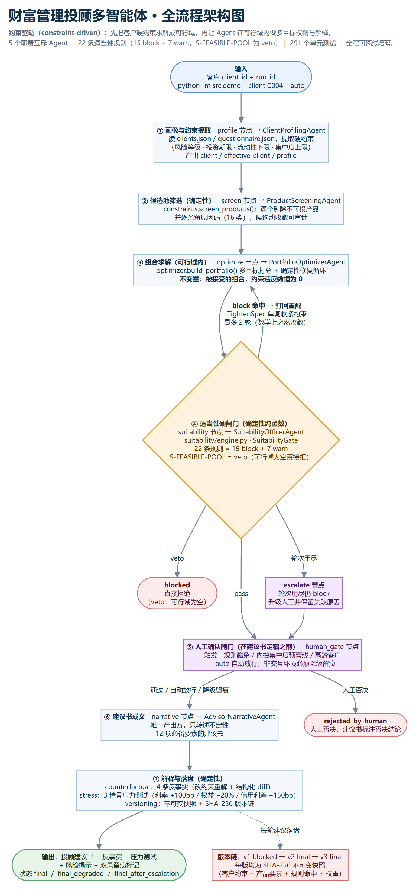
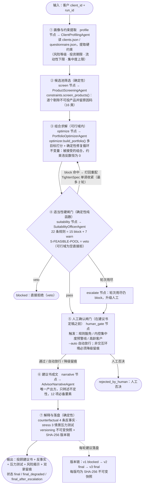
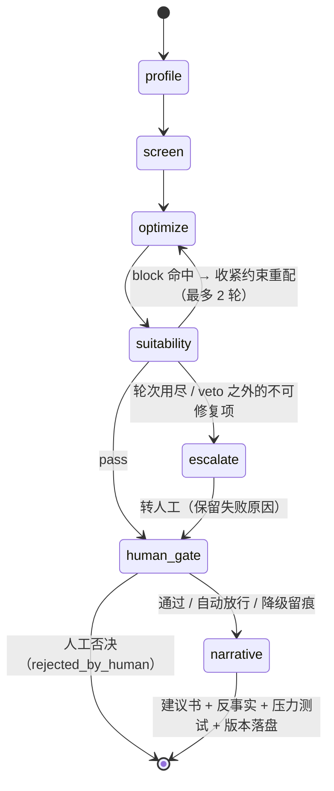

# 财富管理投顾多智能体 · 全流程架构图

> 本文件由项目代码反向核对后手工整理：节点名、连边、规则条数、状态枚举均取自
> `src/pipeline.py`、`src/engine/langgraph_engine.py`、`src/engine/native.py`、
> `src/suitability/rules.py`，与代码一致。

## 一句话定位

**约束驱动（constraint-driven）**：先把客户硬约束求解成可行域，再让 Agent 在可行域内
做多目标权衡与解释。确定性的部分（约束校验、适当性判定、压力测试、版本快照）**绝不交给模型**。

## 主流程图（Mermaid 源码）

## 状态机（同上流程的等价表述）

## 三条关键设计约束

| 约束 | 代码位置 | 说明 |
| --- | --- | --- |
| 可行域单调收紧 | `src/constraints.py` `TightenSpec` | 打回重配只会让约束更严，因此多轮必然收敛，不会来回震荡 |
| 被接受的组合违反数恒为 0 | `src/optimizer.py` `build_portfolio` | 结构性保证（修复循环兜底 + 现金缓冲），不是概率事件 |
| 人工确认在定稿之前 | `src/pipeline.py` `node_human_gate` | 未确认/被否决时不会产出正常定稿，流程上锁死 |

## 双引擎一致性

`src/engine/langgraph_engine.py`（默认）与 `src/engine/native.py`（零依赖降级，`MAX_STEPS=64`）
**共用同一批节点函数与同一套路由判定**（`AdvisoryPipeline.route_after_suitability`），
连边顺序一致：`suitability --pass--> human_gate --> narrative --> END`，
`--reject--> escalate --> human_gate --> narrative --> END`。
